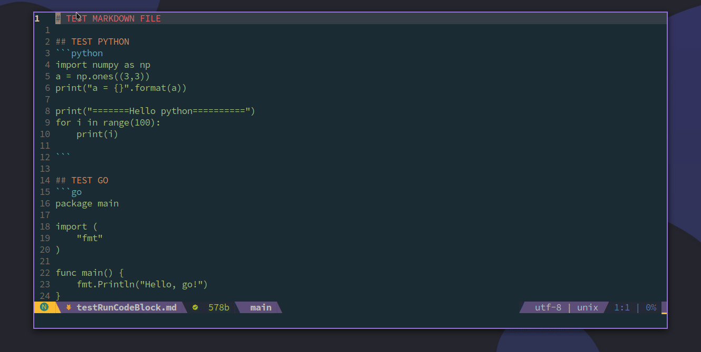
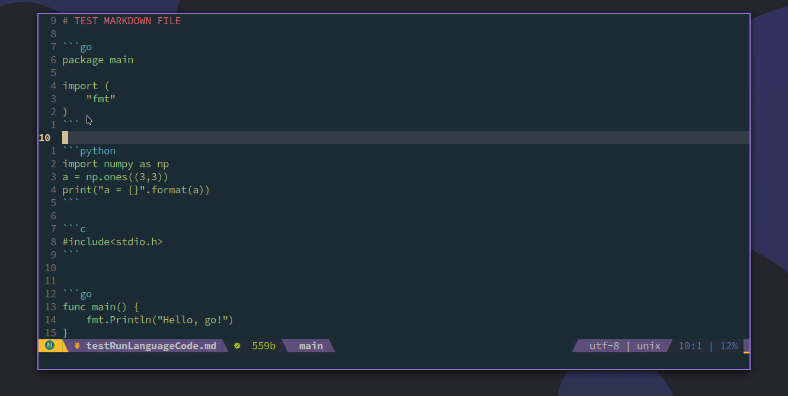
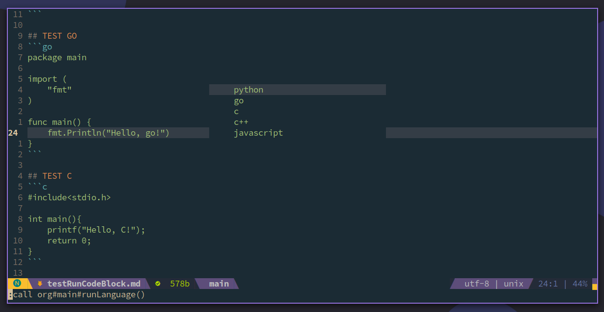
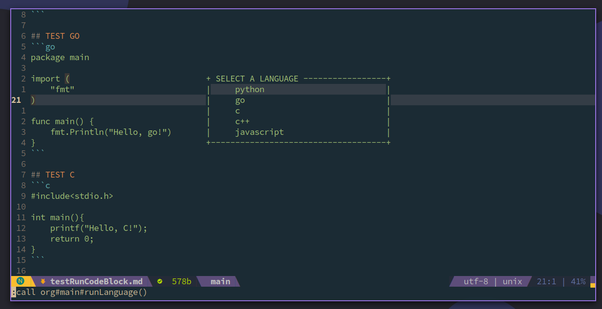
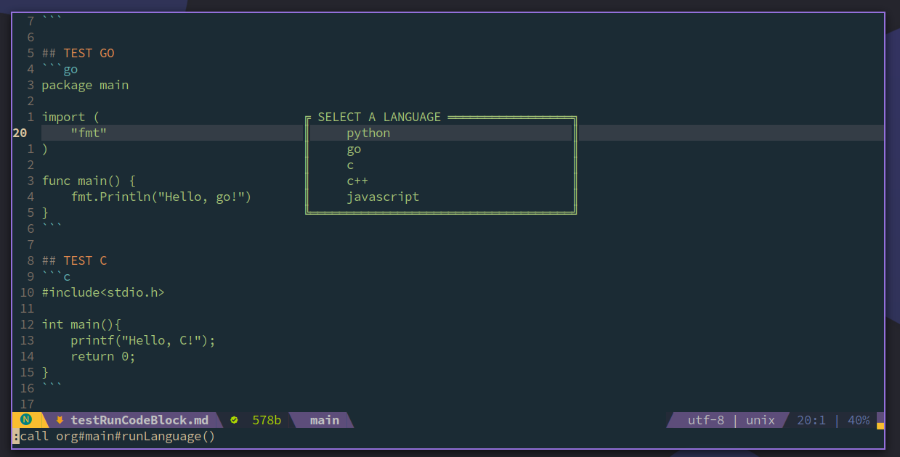
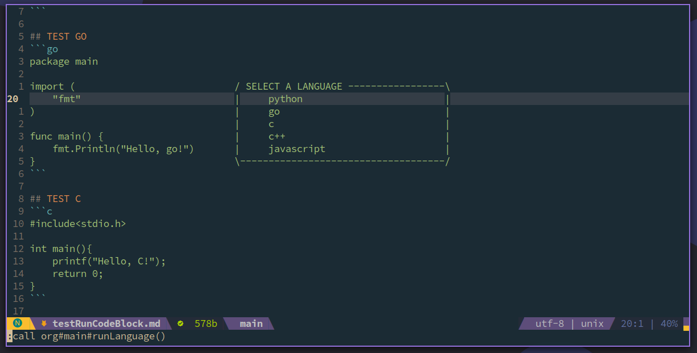

# Markdown-Org


ENGLISH  |  [中文版](./README_cn.md)

## Show





## Introduction

1. You can preview the result of every code block in markdown, and the result will be showed in floating window. It does not discrupt your current winodw layout.

2. If there are mulitple language in your markdown, you can choose to run one of them. It will select all code blocks using the language, and run them in the order which they appear in the text. Finally, the result will be showed in floating winodw.

## Install

If you use `vim-plug`, you can install by following command:
```vim
Plug 'demonlord1997/markdown-org', {'for':'markdown'}
```

If you use `dein`, you can install by following command:
```vim
[[plugins]]
repo = 'demonlord1997/markdown-org'
on_ft = 'markdown'
```

## Setting

If you set `let g:default_quick_keys=1` in your `.vimrc` or `init.vim`, you will use default setting.
```vim
let g:default_quick_keys = 1
```

### Default Quick Keys and Parameters
| Parameters / Quick keys   | Function                                                                    |
|---------------------------|-----------------------------------------------------------------------------|
| `Alt+b`                   | Expand the result of current code block                                     |
| `Alt+l`                   | Run all code blocks of a language, and it will popup select box of language |
| `g:language_path`         | Set evnironmental path of languages                                         |
| `g:org#style#border`      | Set style of border (0, 1, 2, 3, 4, 5), 0: no border                        |
| `g:org#style#bordercolor` | Set color of border                                                         |
| `g:org#style#color`       | Set color of result text                                                    |
### Border Style

| Border number |                                     Show                                     |
|:-------------:|:----------------------------------------------------------------------------:|
|    border0    |  |
|    border1    |  |
|    border2    |  |
|    border3    |  |
|    border4    |  |
|    border5    |  |

### Custom Parameters and Quick Keys Setting
If you wish custom parameters and quick keys, you can refer the example:

```vim
let g:default_quick_keys = 0
let g:org#style#border = 2
let g:org#style#bordercolor = 'keyword'
let g:org#style#color = 'Identifier'
let g:language_path = {
            \ "python":"python",
            \ "python3":"python3",
            \ "go": "go",
            \ "c": "gcc",
            \ "cpp": "g++",
            \ "c++": "g++",
            \ "javascript": "node",
            \ }
nnoremap <silent> <M-b> :call org#main#runCodeBlock()<CR>
nnoremap <silent> <M-l> :call org#main#runLanguage()<CR>
```

1. You need set `let g:default_quick_keys=0`, it will disable default setting.

2. `g:org#style#border` can be set to 0 - 5.

3. `g:org#style#bordercolor` and `g:org#style#color` can be set different colors. You can choose a color from `keyword`, `Identifier`, `Statement`, `Comment`, `PreProc`, `Ignore`, `Label`, `Conditional`, `Exception`, etc. The final effect will depend on your current theme.

4. `g:language_path` can be used to set different languages' evnironmental path. If your evnironment of the language is ok, default setting will work well. If your evnironment exist some problems, for example, when you input python, you can not enter interactive mode. In this case, you can write your python path into `g:language_path`:

```vim
let g:language_path = {
            \ "python":"/usr/bin/python",
            \ "python3":"python3",
            \ "go": "go",
            \ "c": "gcc",
            \ "cpp": "g++",
            \ "c++": "g++",
            \ "javascript": "node",
            \ }
```

5. `org#main#runCodeBlock` is the function to run code block, and `org#main#runLanguage` is the function to run a language. You can refer befor example to bind you quick keys.

## Thanks

**Finally, floating window mainly refers to [vim-quickui](https://github.com/skywind3000/vim-quickui) of [Linwei](https://github.com/skywind3000). Thanks the excellent project provided by Linwei.**

