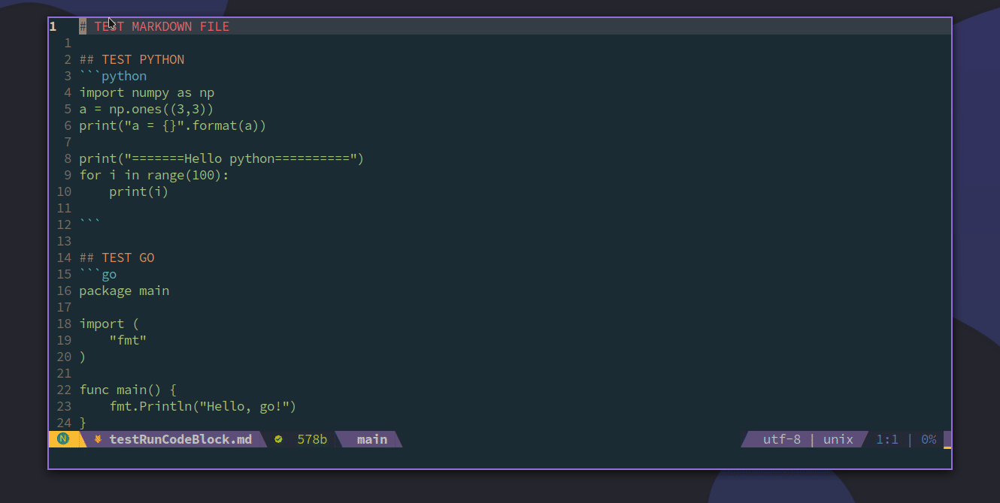
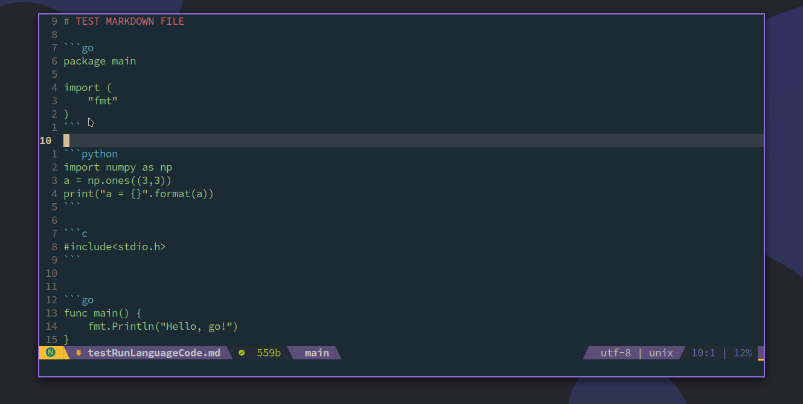
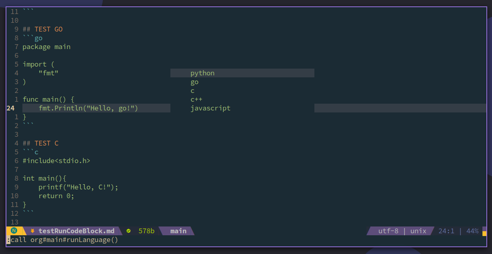
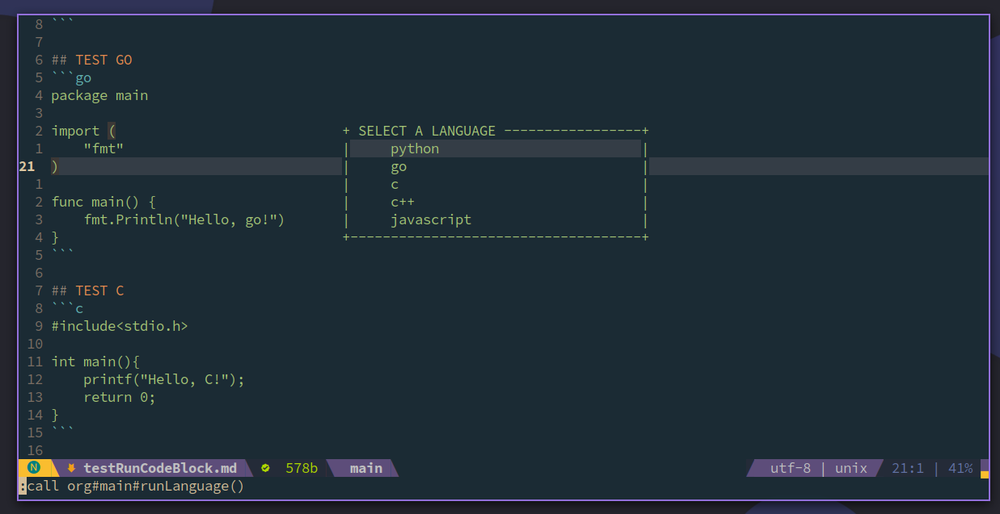
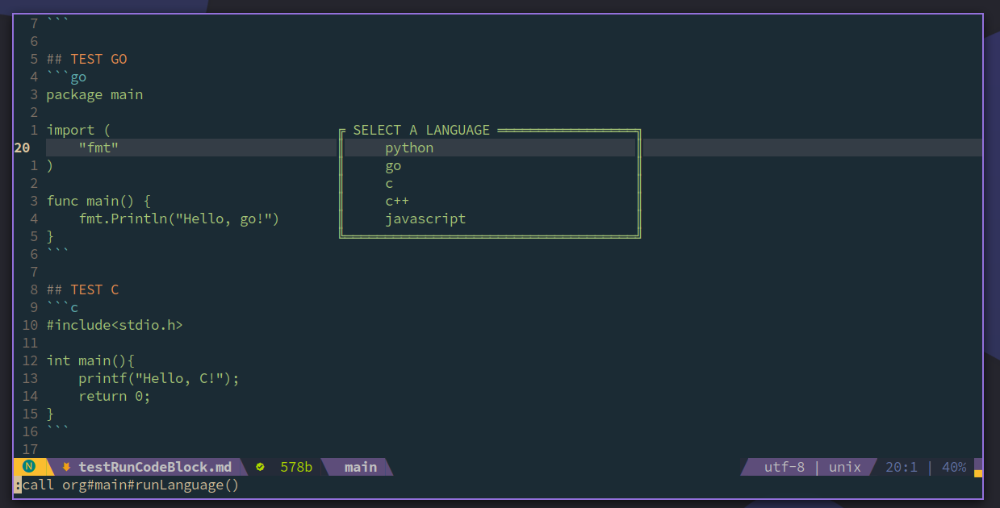
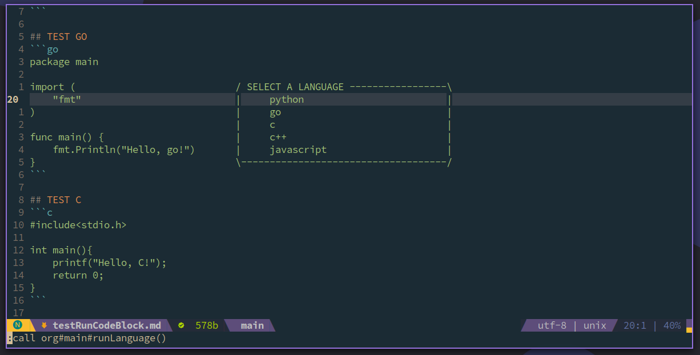
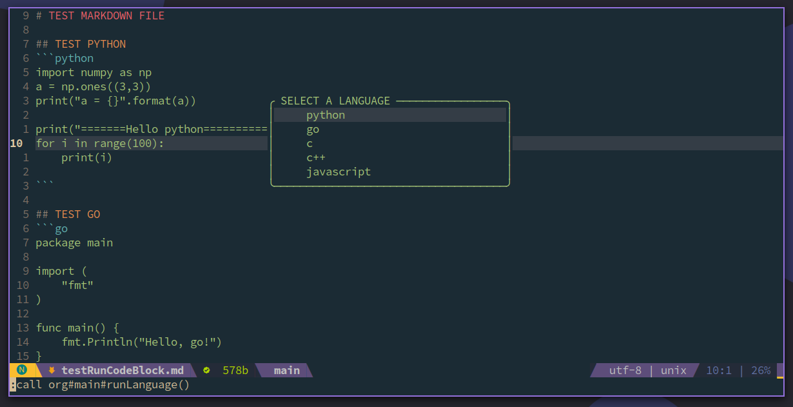

# Markdown-Org


[ENGLISH](./README.md)  |  中文版

## 展示





更多截图看[这里](./screenshot)

## 介绍

1. 你可以在markdown中预览每一个代码块的运行结果，结果以浮动窗口的形式展示出来，它不会打乱你现有的窗口布局。

2. 如果你的markdown中有多种语言，你可以选择运行其中一种语言，它会帮你把所有这种语言的代码块挑选出来，并按照在文中出现的次序，依次运行，结果以浮动窗口的形式展示出来。

## 安装

如果你用`vim-plug`，你可以通过下面命令安装
```vim
Plug 'demonlord1997/markdown-org', {'for':'markdown'}
```
如果你用`dein`，你可以通过下面命令安装
```vim
[[plugins]]
repo = 'demonlord1997/markdown-org'
on_ft = 'markdown'
```

## 配置

在你的配置文件（`.vimrc`/`init.vim`）中，写入
```vim
let g:default_quick_keys = 1
```
将启用默认配置

### 默认快捷键和参数

| 参数/快捷键               | 功能                                         |
|---------------------------|----------------------------------------------|
| `Alt+b`                   | 展开当前代码片段的运行结果                   |
| `Alt+l`                   | 运行某种语言的所有代码片段，会弹出语言选择框 |
| `g:language_path`         | 设置语言的环境路径                           |
| `g:org#style#border`      | 设置边框的风格（0, 1, 2, 3, 4, 5），0为无边框     |
| `g:org#style#bordercolor` | 设置边框颜色                                 |
| `g:org#style#color`       | 设置结果文本的颜色                           |

#### 边框样式
| 边框编号 |                                   效果展示                                   |
|:--------:|:----------------------------------------------------------------------------:|
|  border0 |  |
|  border1 |  |
|  border2 |  |
|  border3 |  |
|  border4 |  |
|  border5 |  |

### 自定义参数和快捷键设置
如果你不想使用默认配置，你可以自定义一些参数和快捷键。示例如下：

```vim
let g:default_quick_keys = 0
let g:org#style#border = 2
let g:org#style#bordercolor = 'keyword'
let g:org#style#color = 'Identifier'
let g:language_path = {
            \ "python":"python",
            \ "python3":"python3",
            \ "go": "go",
            \ "c": "gcc",
            \ "cpp": "g++",
            \ "c++": "g++",
            \ "javascript": "node",
            \ }
nnoremap <silent> <M-b> :call org#main#runCodeBlock()<CR>
nnoremap <silent> <M-l> :call org#main#runLanguage()<CR>
```
1. 你需要将`g:default_quick_keys`置为0，以表示禁用默认设置。

2. `g:org#style#border` 可以设置为0-5中的数值。

3. `g:org#style#bordercolor`和`g:org#style#color`设置为不同的高亮色。你可以设置为`keyword`、`Identifier`、`Statement`、`Comment`、`PreProc`、`Ignore`、`Label`、`Conditional`、`Exception`等不同的值，具体效果会根据你的主题而定。

4. `g:language_path`写入不同语言的环境路径，如果你环境配置的没有问题，默认的设置就可以很好的工作，如果你的环境有问题，比如你输入python并不能启动python的交互模式，那么你可以将你python的路径写入到`g:language_path`中：
```vim
let g:language_path = {
            \ "python":"/usr/bin/python",
            \ "python3":"python3",
            \ "go": "go",
            \ "c": "gcc",
            \ "cpp": "g++",
            \ "c++": "g++",
            \ "javascript": "node",
            \ }

```
5. `org#main#runCodeBlock`为运行代码块的函数，`org#main#runLanguage`为运行某种语言的函数，你可以按照上面例子绑定到你所喜欢的按键上。

---
## 致谢

**最后，浮动窗口的设计主要参考了[韦大](https://github.com/skywind3000)的[vim-quickui](https://github.com/skywind3000/vim-quickui)，感谢韦大提供的优秀范例。**
